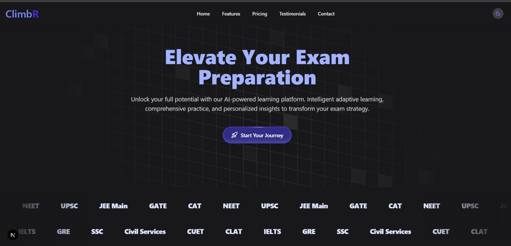
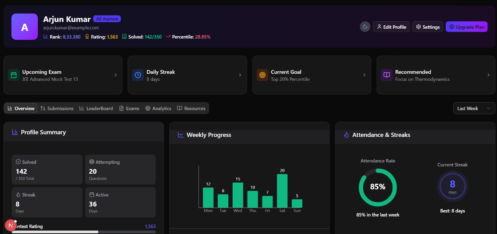
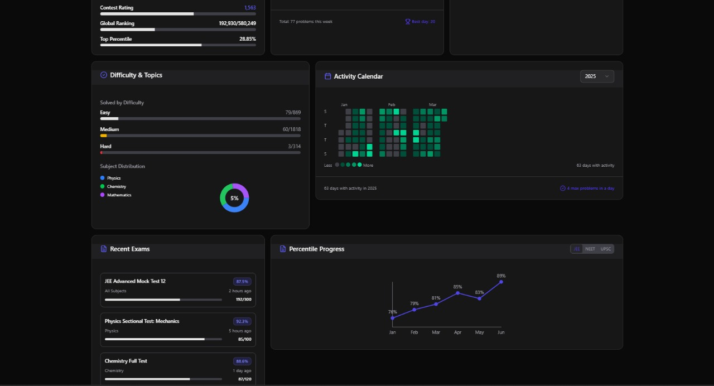
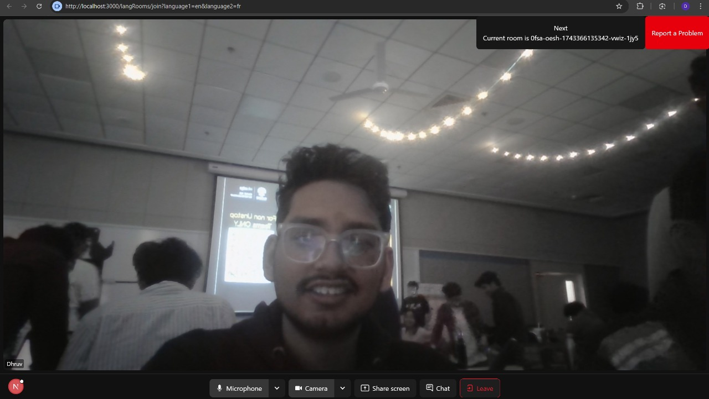
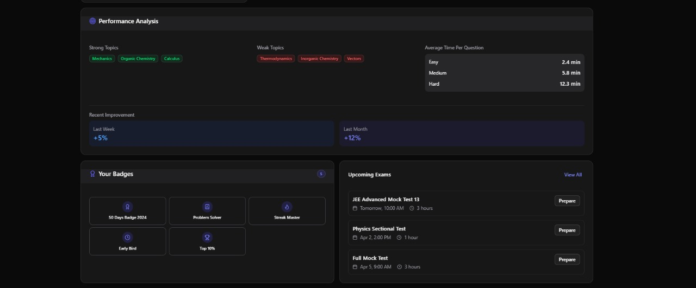
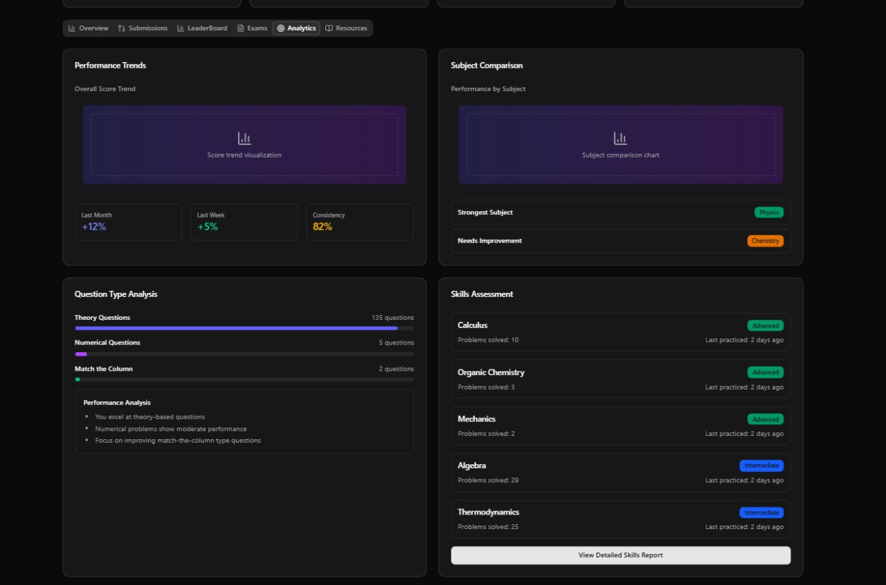
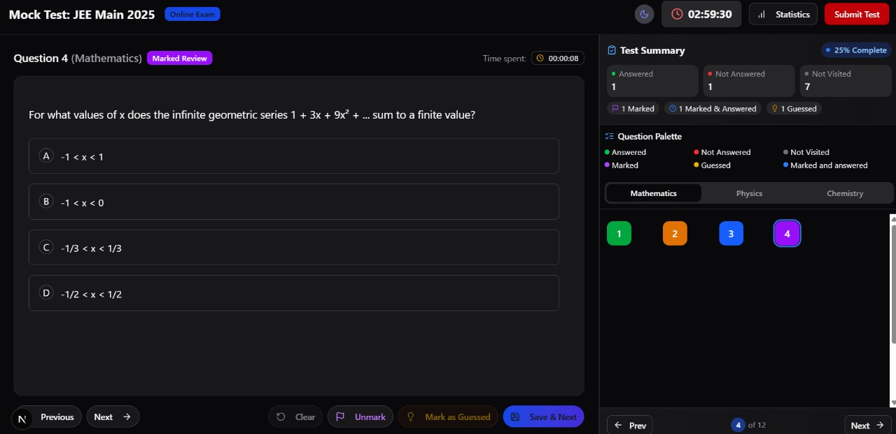

# ClimbR – AI-Powered EdTech & Student Support Platform

ClimbR is more than just an education platform—it's a **lifeline for students** navigating academic stress, career confusion, and mental well-being. Our platform combines **AI-driven adaptive learning, anonymous counseling, and real-time study rooms** to ensure that **no student feels lost or alone** on their educational journey.


## 💔 The Problem: Why Students Need ClimbR


### 1️⃣ **Isolation & Lack of Support**
Many students feel **disconnected and alone**, especially during high-pressure exam seasons. Without proper guidance, study partners, or emotional support, academic challenges can become overwhelming.

### 2️⃣ **Rising Student Mental Health Concerns**
**Academic pressure, career anxiety, and personal struggles** have led to a concerning rise in student depression and anxiety. Many don't seek help due to **stigma** or lack of accessible support options.

### 3️⃣ **Ineffective One-Size-Fits-All Learning**
Most test prep platforms provide **generic content**, failing to address individual learning styles and knowledge gaps. Students waste precious time on ineffective study methods, leading to frustration and burnout.

### 4️⃣ **Career Path Uncertainty**
**Unclear career choices, misinformation, and lack of proper mentorship** leave students confused about their future. They desperately need **personalized, data-driven career guidance** to make informed decisions.

## 🌟 Core Features


### 🎯 **Adaptive Learning & Exam Preparation**


- **Smart PYQs** – AI dynamically adjusts question difficulty based on student progress
- **AI Weakness Detection** – Identifies knowledge gaps and recommends focused study materials
- **Daily Challenges & Gamification** – Maintains motivation through leaderboards, badges & study streaks
- **Institutional Test Series** – Enables colleges & institutes to run structured mock exams

### 🧠 **Mental Well-being & Support Network**


- **Anonymous Peer Counseling** – Safe space to discuss stress, anxiety, and academic pressure
- **AI-Powered Career Guidance** – Personalized career pathways based on strengths & interests
- **Virtual Study Rooms** – Connect with study partners via **LiveKit-based video collaboration**

### 🔒 **AI-Powered Moderation & Safety**


- **Toxic Speech Detection** – Automatically mutes users for offensive speech in video calls
- **NSFW Content Prevention** – AI instantly identifies and removes inappropriate content
- **Trust Score System** – Maintains community standards through reputation management

## 🖥️ Technology Stack


| Component | Technologies |
|-----------|-------------|
| **Frontend** | Next.js, React, Tailwind CSS, ShadCN, magicUI |
| **Backend** | Next.js, tRPC Router, Prisma, PostgreSQL, Bun |
| **AI/ML** | Agent.ai with LangChain, LangGraph, LangSmith for analytics |
| **Real-time Communication** | LiveKit for video-based study rooms & counseling |

## 🚀 Getting Started

### Prerequisites
- Node.js 18+ and npm/yarn
- PostgreSQL database
- LiveKit account for video features
- API keys for AI services

### Installation

**1. Clone the Repository**
```bash
git clone https://github.com/yourusername/ClimbR.git
cd ClimbR
```

**2. Install Dependencies**
```bash
npm install
```

**3. Configure Environment Variables**
Create a `.env.local` file with the following:
```env
NEXT_PUBLIC_LIVEKIT_URL=your_livekit_server_url
NEXT_PUBLIC_PERSPECTIVE_API_KEY=your_api_key
NEXT_PUBLIC_DEEPGRAM_API_KEY=your_api_key
DATABASE_URL=your_postgresql_url
CLERK_SECRET_KEY=your_clerk_secret_key
GEMINI_API_KEY=your_gemini_api_key
```

**4. Start the Development Server**
```bash
npm run dev
```
Visit **http://localhost:3000** to see ClimbR in action!

## 📱 Application Screenshots









## 📈 Business & Revenue Model

Our sustainable approach combines:

- **Freemium Model** – Core features free for all students, premium features for enhanced experience
- **B2B Partnerships** – Educational institutions subscribe for advanced analytics, custom test series & AI career counseling
- **Strategic Sponsorships** – Carefully curated educational partnerships and recommendations

## 🔮 Roadmap & Future Enhancements

- **AI Tutoring Assistant** for personalized doubt solving
- **Multi-language Support** to reach diverse global learners
- **Blockchain-based Skill Certifications** for verifiable credentials
- **Mobile Applications** for iOS and Android

---

*ClimbR: Empowering every student to reach new heights in education and well-being.*
